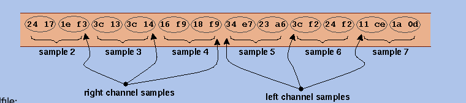

## PCM

> 脉冲编码调制。是一种模拟信号的数字化方法。

PCM 不是一种格式。他只是一种方法，利用这种方法存储起来的音频，最常见的就是 WAV 格式。
声音由振动产生，同样地，反向通过传感器可以将这种振动转换为模拟信号。而模拟信号按照一定的频率保存下来的离散数据就是无损的音频数据。

PCM 方法保存的音频的质量，同时也是体积，由三个因素所决定：

* 采样率：SampleRate
* 位深：Bit Depth
* 声道数：Channel

### 采样率 SampleRate

采样率故名思议就是采集声音样本的频率。声音的采集过程和录像类似。只不过录像采集光，而录音采集振动。
想象一下，你用相机拍照高速连拍，每秒拍 24 次，合并起来就可以得到一段 24 FPS 的影像。但在 24 帧之外的图像，都被丢失了。
录音的采样也是同理。一段 3s 的声音，如果每秒采集一次，则为 1HZ 采样率。

```
|--*--*--*------->
|  1  2  3     (时间)
```

最终你可以得到 3 个点的音频数据。这当然是远远不够的，这个数据丢失太多了。我们需要的是更接近真实的声音。

PCM 数据采样率最常见的就是 44100 hz。这种采样率也是 Google 所推荐的在 Android 平台兼容性最佳的参数值。
他表示每秒采集 44100 次数据。想象一下，在 3s 时间内，连续采集 44100 x 3 次，是何等的快速。

```
|*********------->
|  1  2  3
```

如果采样率越高，意味每秒采集数更多。则采样点之间约接近，音频曲线也就约平滑，过度越自然。

下图只看横向 x 轴的密集程度。左边是低采样率，横向数据比较稀疏，右边是高采样率，横向数据比较密集。


*这里我们忽略了采样的过程，因为那部分属于信号系统相关知识，在我知识盲区之中 :P，不过不影响我们理解基础概念*

### 位深

如果说采样率在图中表示的是，X 轴的密集程度。采样率越高，X 轴越密集。那么位深，就是表示 Y 轴的密集程度。
下图是 4bit 位深的采集示例图。可以看到纵向 y 轴最高和最低差值为 16，意味着每个采样点可以存储 16 种情况的声音。这是什么意思呢？


我们已经有了每秒的采集次数，也就是采样率。但每次采样后，数据如何存储我们还没有定义。
我们知道，录像每秒的数据就是那一帧的图像（不考虑压缩情况，此时每帧都是关键帧）。那对于声音来说，每一个采样点又是什么来存储呢？

PCM 使用的是二进制数据来存储采样点的声音数据。也就是 01。位深就是指使用多少位 01 数据来存储每个采样点的声音数据。
如果位深为 4bit，那么就是使用 4 个位的二进制来存储每个点的声音数据。

换个角度来考虑，也可以通俗地将位深理解为声音的丰富程度。如果我们使用 2 位二进制数据来保存数据。那么不管怎么采集，每个采样点都只有 0 和 1 两种情况
那么 3s 数据，采样率为 1HZ，就可能出现：

```
   0  1  0
|--*--*--*------->
|  1  2  3     (时间)
```

如果频率提升到 2HZ

```
 00 11 00
|--*--*--*------->
|  1  2  3     (时间)
```

只要位深还是 2bit，那么永远只能记录 0 和 1 的声音的组合。无法记录更丰富的声音类型。
比如一段声音序列可能为：`0 1 0 0 1 1 0 0 1 0 1 0 0 0`，连续地播放，就是一段音波。

如果我们用 4bit 来存储采样点数据，那么每个点就有 16 种情况：

*正弦波*

```
7, 9, 11, 12, 13, 14, 14, 15, 15, 15, 14, 14, 13, 12, 10, 9, 7, 6, 5, 3, 2, 1, 0, 0, 0, 0, 0, 1, 1, 2, 3, 5, 6, 7
```

如果我们用 16bit 来存储采样点数据，那么每个点的声音可以有 65536 种情况。

其实 PCM 数据的存储，有点像 RGB 颜色模型。RGB 颜色是三种颜色的称呼：红、黄和蓝。
比如 `#F8F7F6`，每个字节(8bit)表示一种颜色的强度：红色 `0xf8`，黄色 `0xf7`，蓝色 `0xf6`。
这个 RGB 就像是采样率为 3HZ 位深为 8bit 时长为 1s 的数据 ;)。而这三种颜色由排列组合出 $2^{10}$种颜色组合。

### 声道

声音的频道数是针对输出而言的。几个声道就表示支持几个输出。
一般而言的（联合）立体声：Joint Stereo，就是指左右两条声道，两条声道声音数据一致，每一帧数据左右声道都连在一起：

```
// 单声道数据
A B C D E
// Joint Stereo
AABBCCDDEE
```

这自然导致了音频大小成倍上升：双声道数据大小是单声道的两倍。

*WAV 声道示例*



### PCM 体积

我们只讨论标准的 LPCM 存储成 WAV 文件的体积计算公式。如前文所述，PCM 大小由三个因素决定

* Sample Rate
* Bit Depth
* Channels

可以很容易得到 PCM 文件大小为：

$$
SampleRate \times bitDepth \times channelCounts
$$

假设一个采样率为 44100HZ，位深为 16bit，声道数为 2  的 WAV，60 秒大小应为：

$$
44100 \times 16bit \times 2 \times 60s \div 8bit = 10,584,000 Byte = 10.0936889648 MB
$$

一分钟应该是 10MB 的大小。可以说是非常大了。
体积是限制 PCM 称为流媒体的因素。所以才有各种层出不穷的无损或有损压缩格式，来适应各方需求。

## 比特率：Bitrate

比特率不止出现在音频中，更常见的，是出现在网络传输中。
我们的网速，就经常使用比特率来表示：100MBps，指的是理论下每秒传输 100MByte 的数据。

**那在音频领域，这个词是什么含义呢？**

如果是无损的 PCM 制作的音频数据，则比特率没有太大意义。因为参数已经确定了。我们上面的 44100, 16bit, 2 Channel 的参数的 PCM，他的比特率为 1.4Mbps（就是把上面的 60s 改为 1s 就可以算出来啦）。

比特率这个参数更多的是来描述压缩音频，特别是有损压缩音频的质量。
对于有损压缩，他生下来就要考虑我要压成什么样子 >_>。对于流媒体领域，他们更看重流量带来的压力。PCM 1.4Mbps 的比特率极容易占据大量带宽，同时用户加载时间也将变长。所以他们使用比特率来反向调节音频质量，也就是压缩和丢失的程度。

* 如果用户网络比较差，24kbps 或许是一个不错的选择，这样至少用户可以听到内容。
* 如果用户网络良好，**付费意愿**也比较高，那么 256kpb 也不是不行。

国内的流媒体会员，大部分都可以达到 320kpb 的高比特率。
音频压缩属于一个更大的领域，我没有涉猎，只提几句我了解的。

**音频压缩主要从两方面入手**：

* 依赖 Psychoacoustics 心理声学理论
  		- 一方面移除掉人耳物理上无法听到高低频声音
  		- 另一方面探究人耳如何解析声音的频率，依次来决定哪些频率的声音是最重要的频率
* [数据压缩](https://zh.wikipedia.org/wiki/%E6%95%B0%E6%8D%AE%E5%8E%8B%E7%BC%A9)
  		- 把音频看作文件进行压缩，是常规的压缩思路
  		- 比如 FLAC 使用的 [线性预测编码](https://zh.wikipedia.org/wiki/%E7%BA%BF%E6%80%A7%E9%A2%84%E6%B5%8B%E7%BC%96%E7%A0%81)

### CBR 恒定比特率

CBR 是指定一个固定的比特率，无差别地对待每一帧的数据。这种场景主要是为语音通信设计，这样频率范围和变动趋于最小。

### ABR 平均比特率

指定一个平均的比特率，允许不同帧有略微上下波动

### VBR 可变比特率

接受一个恒定的质量设置，允许比特率进行波动以便达到该质量水平。编码器可以灵活调度资源，在容易压缩的、对质量影响小的频率进行高压缩，那部分比特率将很低；而对于压缩比较困难的音频，保持较高的比特率。

- - -

上述是我的个人理解，难免存在缺漏，有问题欢迎指出。

参看：

* [Understanding Sample Rate, Bit Depth, and Bit Rate](https://www.headphonesty.com/2019/07/sample-rate-bit-depth-bit-rate/)
* [Pulse-code_modulation Wiki](https://en.wikipedia.org/wiki/Pulse-code_modulation)
* [kmark/AudioRecordActivity.java](https://gist.github.com/kmark/d8b1b01fb0d2febf5770)
* [WaveFormat](https://ccrma.stanford.edu/courses/422-winter-2014/projects/WaveFormat/)
* [Linear Pulse Code Modulated Audio (LPCM)](https://www.loc.gov/preservation/digital/formats/fdd/fdd000011.shtml)
* [mp3-quality.html](http://www.harmjschoonhoven.com/mp3-quality.html)