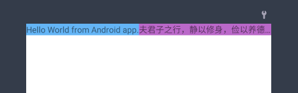

我将在「自定义布局」系列文章介绍我对「自定义布局」的理解、实践经验和个人总结。文章系列可能会有三到四篇，本文是第一篇，介绍一点前置知识。如果您看到本文且对内容有任何意见或建议，都可以随时在网站首页找到方式联系我，我热切期盼能和更多的人交流想法！

## 1. 自定义布局的优势

1. 避免读取 XML 的 IO 耗时和布局解析（layout inflate）的耗时
2. 避免 `findViewById` 的耗时
3. 避免多次测量

第一、二点我们都好理解，但是第三点就不是很直观了。这里以 LinearLayout 为例，讲一下重复测量的问题。

### 2. 重复测量（和布局）

在 LinearLayout 中，当我们给子控件设置了权重 `android:layout_weight` 属性后，子控件将允许按比例分配 LinearLayout 的剩余空间。比如，我们有如下 XML：

```xml
<?xml version="1.0" encoding="utf-8"?>
<LinearLayout xmlns:android="http://schemas.android.com/apk/res/android"
    xmlns:tools="http://schemas.android.com/tools"
    android:layout_width="match_parent"
    android:layout_height="match_parent"
    android:orientation="horizontal"
    android:id="@+id/ll_root"
    tools:context=".MainActivity">

    <TextView
        android:id="@+id/tv_1"
        android:layout_width="wrap_content"
        android:layout_height="wrap_content"
        android:background="#64B5F6"
        android:singleLine="true"
        android:text="Hello World from Android app." />

    <TextView
        android:id="@+id/tv_2"
        android:layout_width="0dp"
        android:layout_height="wrap_content"
        android:layout_weight="1"
        android:background="#BA68C8"
        android:singleLine="true"
        android:text="夫君子之行，静以修身，俭以养德。" />
</LinearLayout>
```




就宽度来说：`tv_2` 设置了权重 1，会瓜分所有剩余空间；而 `tv_1` 设置了 `wrap_content`，表示跟随内容。最终效果是，优先保证 `tv_1` 的显示，有剩余空间就全部都分配给 `tv_2`。
当前（宽度为 `match_parent`）的 `LinearLayout` 的 `measure` 步骤将会如下实现：

1. [第一次遍历](https://cs.android.com/android/platform/superproject/+/master:frameworks/base/core/java/android/widget/LinearLayout.java;l=1141-1274;drc=5d123b67756dffcfdebdb936ab2de2b29c799321) 所有子 View，让他们按照最大可用空间去测量出尺寸

   1. 此时就可以结合父布局（`ll_root`）的宽度（`match_parent`）以及各个子 View 的宽度来计算剩余空间
2. [第二次遍历](https://cs.android.com/android/platform/superproject/+/master:frameworks/base/core/java/android/widget/LinearLayout.java;l=1351-1424;drc=5d123b67756dffcfdebdb936ab2de2b29c799321) 会根据子 View 的 `weight` 来分配剩余空间，设置最终的子空间宽度

这里仅描述大致流程，实际上多种情况需要判断：

1. `ll_root` 本身设置为固定尺寸
2. 部分子 View 没有 `weight` 的情况
3. 全部子 View 都有 `weight` 的情况
   ...

所以网上所说的 `LinearLayout` 需要测量两次的意思是指：在子 View 存在 `layout_weight` 属性时，在一次 `onMeasure` 中进行两次遍历调用子 View 测量的现象。而不管是否子控件是否设置 `android:layout_weight` 属性，`LinearLayout` 都只会对子控件执行一次布局操作。

对于允许创建复杂的「控件约束」的布局来说，重复测量几乎是无法避免的操作。因为设计者希望布局能够尽量覆盖更多实际场景，只要存在约束规则，那么测量流程都会变成：

1. 确定子控件无限制时的宽度
2. 根据剩余空间和「控件约束」来重新调整子控件尺寸

即便是官方推荐的 ConstraintLayout 也是需要两次测量才能实现灵活的约束关系：
1. 第一遍遍历关系获得约束关系式
2. 第二遍对约束关系式求值。

而 FrameLayout 如果有超过一个子控件的尺寸是 `match_parent`，那么也会执行[两次测量](https://cs.android.com/android/platform/superproject/+/master:frameworks/base/core/java/android/widget/FrameLayout.java;l=229-263;bpv=1;bpt=1?q=FrameLayout)。

归根结底，如果要实现**通用的**、**灵活的**约束布局，至少在目前而言，需要两次测量才能实现。

自定义布局牺牲了「通用」的特性，甚至是完完全全为了业务写的特定页面，这样可以根据实际需求安排测量逻辑和布局逻辑，仅一次测量就可以完成需求。换句话说，就是用代码方式实现 XML。

### 2.1 嵌套、嵌套还是嵌套
其实即便是对子 View 进行两次测量或布局，并不会有太大的影响。问题在于嵌套。我们考虑嵌套三层 `LinearLayout`，那么在最后一层的子控件将有 $2^3$ 也就是 8 次的测量。如果被测量的 View 没有对重复测量有所优化，那么将导致明显的性能下降问题。

所以降低嵌套层次也是提升布局性能一种重要方式。自定义 ViewGroup 可以根据实际需求，降低嵌套的机率。一般如果你能用 ConstraintLayout 实现的低嵌套布局，自定义 ViewGroup 都可以简单地写出来。甚至可以比 ConstraintLayout 的嵌套机率更低。

## 3. 自定义布局的劣势

1. 代码不似 XML 一样直观，维护性稍差（但可以通过注释、规范来解决）
2. 无法兼容所有 XML 属性，比如 `android:theme` 就无法设置，这会影响的主题和控件的复用
3. 不是所有 XML 属性都存在 API 可供代码设置

2、3 点几乎无法用其他常规方式实现。3 可以试着用反射的方法修改内部属性，但是依然不是常规方式。这是我们需要承担的成本。在技术调研时，可以考虑 UI 上的控件能否使用自定义的 View 来实现，如果不行，并且该控件具有统一的主题或样式，那么不建议使用自定义 ViewGroup 来实现页面布局。


## 4. 总结

本文简单阐述了自定义布局的优劣势以及我对重复测量的理解。算是一些前置知识，方便技术调研或者刚入门的读者快速通览相关内容。下篇文章将开始介绍自定义 ViewGroup 的流程和常用范式。

---
REF:
- [Performance and view hierarchies](https://developer.android.com/topic/performance/rendering/optimizing-view-hierarchies)
- [Layout Once, Layout Twice — Sold!](https://medium.com/@britt.barak/layout-once-layout-twice-sold-aef156ff16a4)
- [ConstraintLayout, Inside and Out: Part 2](https://wiresareobsolete.com/2016/07/constraintlayout-part-2/)
- [AutoLayout 中的线性规划 - Simplex 算法](https://www.desgard.com/iOS-Source-Probe/Objective-C/UIKit/AutoLayout%20%E4%B8%AD%E7%9A%84%E7%BA%BF%E6%80%A7%E8%A7%84%E5%88%92%20-%20Simplex%20%E7%AE%97%E6%B3%95.html)