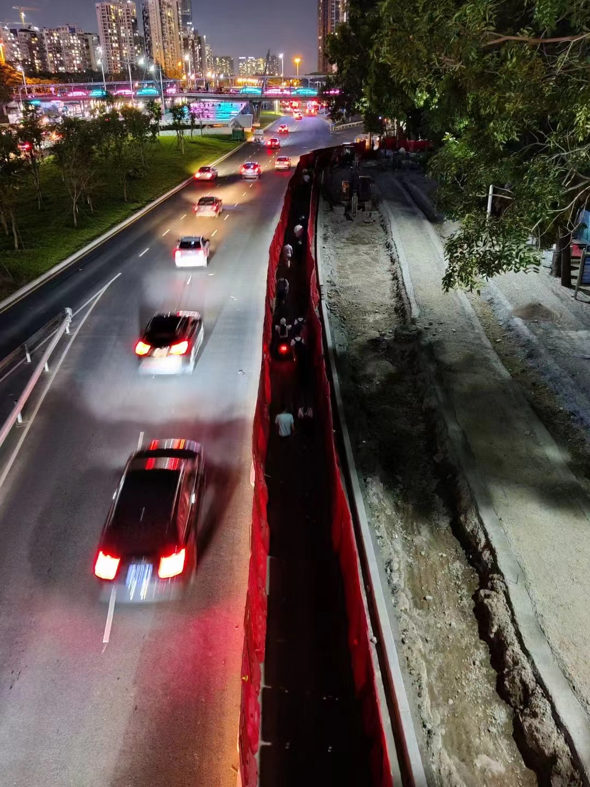

## 序言

又是一个凌晨。人的轨迹仿佛总是在潜移默化中被规划好，在每次不断地出乎意料中，其实是在积蓄又一次历史的重演。

已经很久没有这样熬夜了。虽然有了猫之后（此时思绪被红米的开机声音打断了几秒...），很经常半夜就被叫醒，但是还是能重新睡过去。今天不行，一直刷手机到现在（05:13）。可能是因为我心里在期待一个写年终总结的机会。

这个机会在过去半个月一直在脑袋里酝酿。它应该是在一个风和日丽的假期下午，而不是无法入眠的被猫打扰的凌晨。

## 猫

既然说到猫，我就顺着思路讲下去吧。崽崽来家里已经一年多了，我似乎还是没有完全地接受它的所有行为。不管是拉软便、需要人手喂食、频繁的叫声和半夜的「重拳出击」...有时候我心情真的会因此变得非常糟糕，以至于出现我过去从未有过的失态场面。我猜测是因为在我过去的人生中，还没有遇到这样「无法商榷却又无法摆脱」的场景。

我应该庆幸在我的生活环境的大部分情况下都可以通过沟通来解决问题，而无法通过沟通解决的也可以通过「逃避」来摆脱影响。

但是猫，可不会乖乖地听你的话，甚至无法达成一致亦或是妥协。

在与崽崽相处的这段时间中，我亦从中窥到养育下一代之一隅。孩子，对于父母来说是一个真正的无法摆脱的生物。这是一段无法抛弃的关系。父母与子女之间还无法是完全存粹的「互为手段」的关系。我难以想象从孩子出生那一刻开始，我的脑海和心智需要被强制占据大部分空间去容纳他们。

虽然子女与猫是完全不同的，子女作为人类，是具有「可商榷」能力之高级生物。但是随之而来的便是更高的复杂度和可能性。坦白讲，我对教育「好」下一代毫无信心。

特别是在这样一个「伟大、光荣、正确」的时代，人需要在自我、社交关系和社会的摇摆中生存。

一只猫，对于我们来说，「性价比」可能更高。毕竟，猫不需要知道自己从何而来、往哪里去。

## 工作

今年最让我开心的事情之一，就是换了一份比较满意的工作。前司的工作对我来说是一份理想的创业公司职位，它几乎具备一个（技术相关的）应届生所需要的大部分特性：

* 恰好正确的行业：实现正向盈利，不会因为倒闭而匆匆换新工作导致持续性不强、简历不好看
* 核心业务的非核心团队：参与核心业务但不需要花时间应对太多的业务导向安排，比如业务值班、大量的运营类业务等
* 技术团队小：灵活并且技术选型自由度高，你将有更多技术实践的自由，只要对事情负责到底
* Leader Open 且辐射能力强：层级扁平、凝聚力更好、氛围更轻松，可以提供公司底线之上较高的自由度

当然每个优点也有相应的缺点和隐患：

* 创业公司营收压力大、业务变动非常快：相应的员工的压力也更大，体现在技术这边就是「倒排期」、需求管理和版本规划混乱、加班等
* 非核心团队在技术话语权比较低：难以撬动其他技术团队（后端、测试）一起推进或改进存量业务
* 技术团队小：如果没有 Tech leader，那么需要直接对接需求整个周期，非常占用时间；没有专门负责效率和基建的同事，有时候这部分还是非常花时间的（比如基建的稳定性维护等）；规范性靠自觉
* 非常看 Leader 个人风格，垃圾 Leader 会 PUA，好 Leader 会抗事带领大家一起前进。

我在前司呆了两年半，见证它从一个 200 个人不到的公司，迅速成长为一家数千人的某行业前沿企业，期间看着无数人的来来走走、彷徨期望。它像一艘快艇，浪花飞溅中让我得以在后互联网时代触摸尾部红利，却也让我真切感受到黄金时代的汹涌无情。

现在，我们都知道，浪潮可能要退下了。

人不能永远停留在刚毕业时，在经过慎重评估和考虑后，我决定换份工作，寻找新的技术灵感和突破。准备了一段时间后，我拿到了新公司的 Offer。喜欢的业务和喜欢的技术，而且钱（对我来说）给的是真的多。（肯定比不上应届的 「siza」 XD

不过还是有很多不适应的地方：

* 团队更大：细分职责更多，导致沟通成本更高，调整一个需求，可能要多拉4、5个人进群确认逻辑
* 项目更大：代码编写、分支控制、代码提交、需求流转，各种都有流程和规范，灵活度下降很多。项目管理规范性更强，但是编码体验和代码质量并没有提高
* 很多事情不会立刻有结果，基本都是异步任务。需要持续跟进和自己定期「轮询」。包括写代码

不过事事无完美，得到一些东西总要失去部分。而且我擅长在失去某些东西的时候，强行保留一些具有纪念价值的残垣，聊以自慰。

## 学习和其他

今年进步不算特别大。从去年年底，我便自觉遇来了成长的瓶颈期。于是开始主动学习一些专项。比如重新学了 Android 的基础，认知更深刻。也刷了一段时间算法，找到了一些感觉和做题技巧。在前司的时候承担了部分核心的业务，无论是沟通能力还是编码能力都有了挺大的提升。

不过真正的「一整本」的书籍看得少了很多，这不是一个好的信号。

目前的阶段，一方面，现在需要在每个细分领域花上一定的时间才会有成果；另一方面是今年看书的时间少了，尤其是换新工作后，个人时间被缩短了非常多。所以还是需要重新建立新的读书和学习的模式和习惯。

至于开源项目，今年收获意外的多。

* [简单水印-EasyWatermark](https://github.com/rosuH/EasyWatermark) 今年更新了 9 个大版本，基本已经全面改版过、最近还适配了 Material You。对此我还是挺满意的。在里面实验了很多新的技术和开发模式，很自由也很舒服。
* [rosuH/AndroidFilePicker](https://github.com/rosuH/AndroidFilePicker) 今年更新了 5 个版本，大部分是社区反馈的一些 bug 修复。还有一些内部代码的重构。

另一部分巨大变更，是我们购买新的电脑（2020MBP），现在已经成为我的主力 Side Project 开发设备。我个人终于等来了 iPhone 13，不过还是还没有上期盼已久的 13 Pro with Pro Motion。甚至现在觉得 iPhone 13 也有点重，mini 如果有双卡我就果断买了，不过 Apple，你懂的。

AirPods Pro 在用了一年多之后，喜迎[AirPods Pro 服务计划](https://support.apple.com/zh-cn/airpods-pro-service-program-sound-issues)。于是更换了两只新的耳机。AirPods Pro 依然是我觉得（2019年）最值得购买的设备，不过要是现在这个阶段丢了，我不知道我还会不会果断买它。

## 生活和自我

今年在 9 月份换到了更大但更远的地方，我们无法忍受两人一猫窝在一个 17 平米的「一房一厅」里。随之而来的就是通勤时间变长，特别在换新工作后，我的单次通勤时间达到 1 个小时之巨。

换在以前，我是无法接受的。但是今年，不知道为什么我就接受了这个事实。我猜测是因为我已经接受了「（我个人）日益高涨的需求和（我个人）低下的生产力之间的矛盾」这个事实。在这个阶段的这个国家，我无法通过个人努力，可以公平竞争到的一个体面舒适的「家」。

我甚至逐渐接受我就是一个暂时没有环境污染的干电池这个事实，死了后作为骨灰撒向海洋，是一种更加环保的适合我的回收方式。

「卷」是今年我说的最多的新增词汇，相比而言「操」就显得粗俗不堪了。流行的态度是一种亚文化，它滋生在「被禁止」的「法外之地」。我的肉体服从管理，但我的精神目前还是一个法外狂徒。

好消息是我接触了一点经（古）典音乐，我在里面找到了片刻的宁静。我开始听周杰伦，听 2000 年。我并不想回到过去，我只是单纯怀念。

我和女朋友的感情很稳定，我们都很珍惜一起生活的时光。我时常感觉，她是我生命中不可缺少的一个坐标。我总是走得太远，但是我总可以回到她的身边。我也不断地思考爱情、结婚和家庭这些词汇的意义、思考人与人之间的关联、思考性和欲望、思考物质和情感。我认为合适的人，比优秀的人重要。

我重拾了记日记的习惯，虽然不是每天都记录，但也是我和自己对话的一种方式。我时常感觉自己思考太快，经历太多，变得麻木和浮躁，写日记可以让我慢下来。我也更喜欢拿起手机拍照（部分原因是因为换了新手机...），我发现一张当下很普通的照片，以后也可以勾起无数遐思，更何况我是对过去没有什么深刻记忆的人，经常忘记自己度过的时光，照片给了我一个索引。

改变别人是很难的，设身处地体会别人的感受更难。我一直在减少自己对他人的评论和指责，包括心里活动。我依然在强迫自己变得更有人情味一点，去接纳、解析和思考别人的品味和爱好。

## 尾声

我设想过元旦期间，去各地拜访初中、高中、大学和工作之后的朋友们。去听他们一年中经历了什么，听他们对者这一年的看法，聊聊天生活、工作和他们自己。这个计划有点不像我的风格，甚至于完全不是我会做的事情。

我觉得我在开始关心其他的具体的人，希望知道他们的感受。我们生活在同一片天空下，但是我们日常迥异，工作千差万别，阶层分散。当我们不再是「人民群众」的时候，我们究竟还是不是相互地，对方的朋友？我们究竟有没有利益冲突、情感纠葛和命运交集？

我不知道，但是我想去了解、认识，如果可能的话，我也想去接纳。