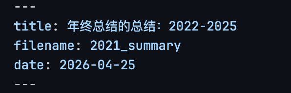
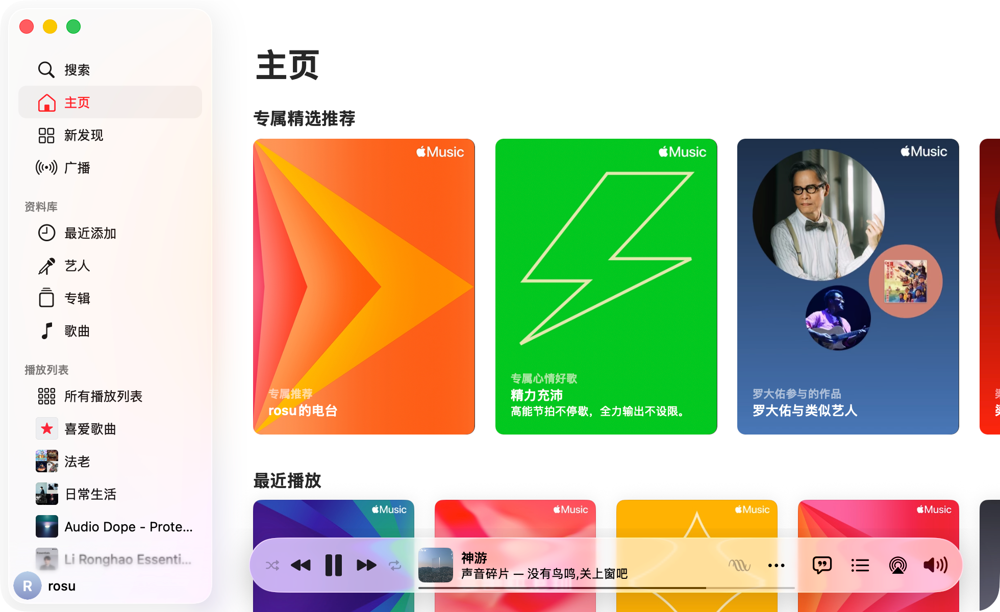
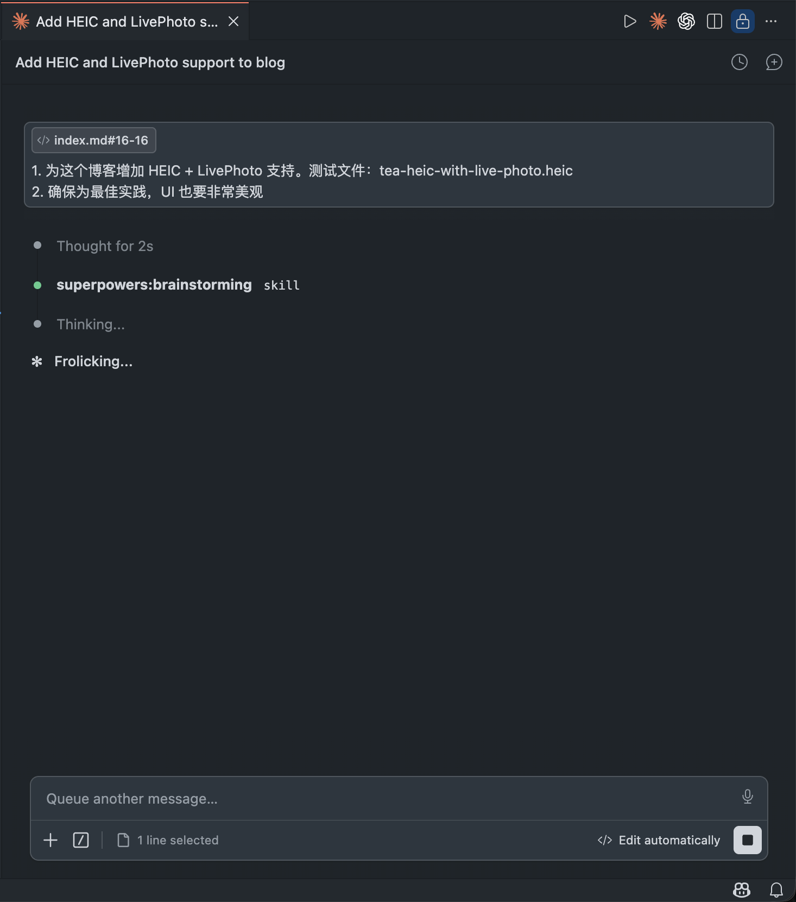
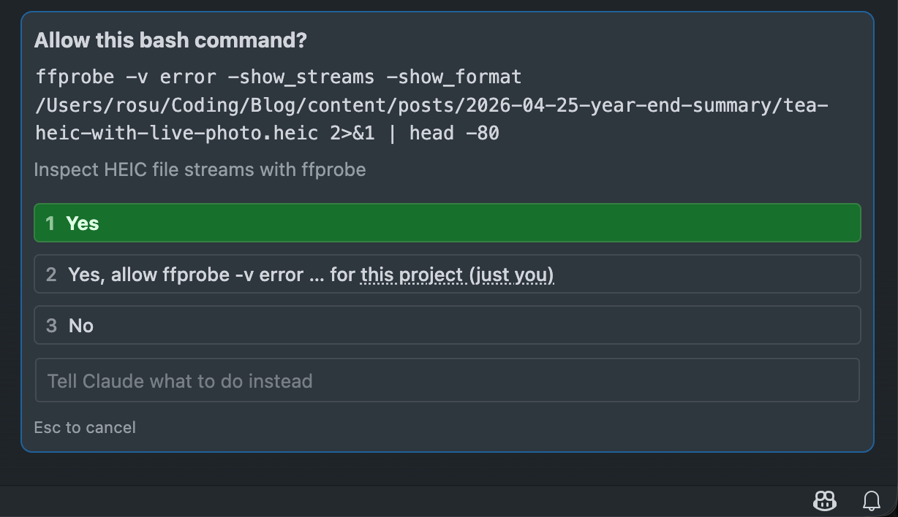

## 前言

*我关掉了 GitHub Copilot 自动补全*

*发现 vscode 字体有点丑，打开了 GitHub 准备下载字体。强烈推荐 Monaspace Neon NF*

*打开了QQ 音乐，发现切换地区后听不了，于是打开了 Apple Music（有家庭订阅，感谢家人们）*

*泡了一杯绿茶。茶是太太之前去成都旅游的时候带给我的。茶壶是昨晚在 Nitori 买的，咖啡杯也是，非常好看！*

发现我的 Blog 好像不支持 HEIC + LivePhoto，感觉得支持一下：Claude Code 启动：

## 尝试 1
我的最初目的，是...

*此处被 Claude Code 打断多次*。

## 前言 2

ok，看起来 CC 已经稳定一些了。

我本来的目的是装修完博客后，补上最近几年没有公开（和总结）的年度总结。但是发现有太多不能说的秘密。涉及到个人、公司，所以每年一篇有点冗长。事实上，有很多事情也都不记得了。所以今早决定只写一篇，挑一些我还有印象的事情来说。

## 2022

2022 是值得记忆的一年。我脑袋里比较深刻的事情：

- 年初，入职两个月，就开始负责核心的连麦功能重构。从零开始构建 SDK，支持多人连麦
- 年中，因为体检指标问题，生理和心理都进入出生以来最大的低谷。深刻影响了我的价值观和人生观。
- 年底（此处切出去发了一条朋友圈，关于[ AI 向上管理的小品](https://x.com/rosu_h/status/2047878159249571910?s=20)）放开了，得了新冠。

<!-- 此时音乐随机到了声音玩具，哇，真好，马上切到声音玩具列表开始播放。 -->

### 连麦：我是如何负责核心功能构建的

2022 年的我，接到那个需求应该是兴奋、惶恐、担忧的。我不确定后面三个词语的先后顺序，但是他们是混合的，无法单独分开，有时候我觉得他们是均匀分布的，感受到的时候，是一起冲进你的脑门的。我觉得五味杂陈这个词很好，这里我应该是**至少是**三味杂陈。

连麦是直播里面非常核心的能力，其次老的连麦线上有挺多问题，「代码也很烂」（mentor 据实陈情），所以「希望你从 0 写一个 SDK，要支持多人连麦，作为一个通用的 SDK，后续替换掉老连麦功能」。

这是个非常大的挑战。我觉得对任何时候的我都是很大的挑战。即便我现在工作了这么多年，承接过非常多的需求，仍然会对这个需求有很多的技术上的想法。**我觉得这侧面反映了连麦是有很潜力和想象空间的事情**。

我当时刚刚入职两个月，前公司也是一个小公司。在大型项目上我没有很好的经验。但我的导师并不这么认为哈哈。他觉得我可以，我当然也似乎觉得自己能做好吧。所以我接下了这个活。

至于导师为什么觉得我可以，我觉得后面或许可以单独出一篇职场故事。

#### 如何在业务需求中突破自己

大部分时候我们做的需求基本都是业务需求，想要取得技术上的进步，我们要抓住一切业务机会，勇于实践技术想法和理念。

业务、技术都要有良好的平衡。这不影响我们在业务需求里追求技术突破。但你要时刻做好 [Eating your own dog food](https://en.wikipedia.org/wiki/Eating_your_own_dog_food) 的准备。

我在当时大约处理了下面几件我觉得在技术上有挑战的事情：
- 模块化，SDK 标准开发：所有接口、能力都和 APP 原有代码隔离，通过统一的接口注入能力。这件事看起来是自然而然，但在实际业务开发中并非能真的所有人都能做到。真实业务场景下，你要考虑人力、时间、复杂度等非技术压力，最终导致有价值的技术方案沦为屠龙之技。
- 全协程构建：现在听起来似乎没什么新鲜，然而实际并非如此。首先，在 2022 年初，协程最新版本是 1.5.x，当时很多人对 Kotlin 协程并不熟悉，甚至没有使用经验（即便在 2026 年也是如此），网上可用资料不是很多，你有时候还要面临版本 bug 带来的问题。要在一个复杂业务 SDK 里使用协程，当然要做好各种调研和可行性判断。
- 完全的 UI 数据隔离、SSOT、数据驱动：又是看起 nothing new，各类技术名词在最近几年大家都耳熟能详。但真正在复杂业务里落地，其实少之又少。大部分都是简单页面/Demo。结合协程，里面有很多实际编码问题要处理。
- 功能模块化：抽离了大量的 RTC 流程内的功能和组件，这个为后续支持大量 RTC 能力异化、不同平台、业务诉求打下了基础

我当时还是很有技术追求的（当然现在也是），在开发的过程中，有很多 bug 都是上面技术选型带来的，但是处理完了长期受益。特别是在项目紧张的时候，因为自己使用新的技术带来的 bug，会十分考验自己的心态。只要你经受住了考验，会成长得非常快。

真实世界中，不乏对着技术方案夸夸其谈，各种新鲜名词、最佳实践信手捏来的人，但少的是可以扛住压力，在真实业务里落地的人。所谓：**听过许多大道理，依然过不好这一生**。这大概也就是知道和做到的距离吧。

#### 负责：业务与代码

连麦业务有很多可以聊的，包括多 RTC，如何支持多人连麦、如何处理不同布局、如何支撑顶层的几十种基于连麦玩法。还要处理很多业务上的场景。比如新旧版本兼容、新老用户兼容、怎么做好平滑切换等。因为很多涉及具体方案和实践，这里就不展开了。

我觉得负责业务，还是要真实研究业务的场景和用户使用习惯。技术视角，不仅仅是单纯代码如何写，还关乎如何更好服务用户的行为。用户习惯决定产品行为，间接影响技术架构。

时至今日，我心里对于维护好这个业务，是有作为技术人的自豪的。从 2022 年第一行代码开始，持续维护到 26 年离职，Android 侧没有一例和代码相关的线上反馈。中间其他端的同事不断调整，Android 这里始终是我在维护。即便中间有不同的同学进入开发，但依然保持了最初的架构，并且快速扩展，支撑业务营收。我觉得这就是技术方案的价值和意义吧。

<!-- 写到这里有点累了，我去喝杯茶，刷一会推特和小红书 -->

### 生活：改变我人生和价值观的事情

